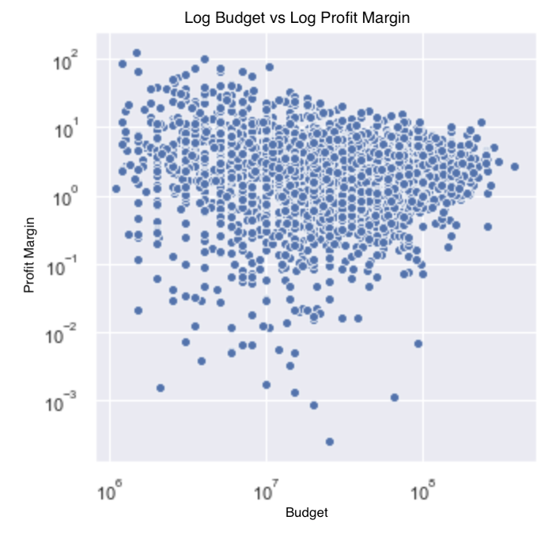

We produce predictive models for movie profitability (log profit margin) and movie popularity (IMDB score) on the ~2500 movies that have buget of over USD1 million in the the [IMDB](https://data.world/popculture/imdb-5000-movie-dataset) and [TMDB](https://www.kaggle.com/tmdb/tmdb-movie-metadata) datasets, making use of lingustic word-vector deatures, graph-based social-network features, and other non-monetary movie features.

### Methodology
- Makes use of lingustic, social-network, and tabular features.
- Performed `RandomForest` and `SVM` Regression, feature selection using `LASSO` and hyperparemters using `grid search`.
- Target variable is `log profit margin = log( (revenue - cost) / revenue)`

#### Feature Generation
- Using movie keywords, trained `word embeddings` from scratch and represented each movie as a `tf-idf` weighting of its keywords
- Using actor-actor graph, computed `PageRank` of actors to serve as actor popularity feature.
- Used `PCA` to reduce dimensions of above and other categorical features.

#### Model Training
We train `sklearn` RandomForest and SVM Regression predictors for log profit margin and IMDB score, optimizing hyperparameters with GridSearch and performing feature selection using LASSO (that is, L1 regularization). RandomForest seems to perform better than SVM Regression in all cases. Note that we choose `log profit margin`, defined as `log( (revenue - cost) / revenue)` as our target variable as it is not correlated with other metrics such as `budget`, `profit`, and so on, and thus constitutes a non-trivial prediction problem.

### Results
 - 0.602 R2 using no financial features to predict for `log profit margin`
 - 0.63 R2 using some financial features to predict for `log profit margin`
 - 0.374 R2 predicting for IMDB score
 
We were able to describe well over half the variance of this feature (R2 .602) in a RandomForest model taking into account features such as Genres, Keywords, Actor PageRank, but no numerical financial or popularity information about budget, profit, facebook likes and so forth. Adding in the financial information we achieved R2 of 0.63.
We also ran the model to predict for IMDB score. Currently, without using any other popularity or finacial based features (only using features for PageRank, keywords, genre and so on) we achiece R2 of 0.374, and work is underway to improving the model.

Analysis performed in this project provides many interesting insights into the interconnections between movies, and for understanding what drives movie success.

# Files:
**Data Analysis**
 - `1. Data Modeling and Analysis.ipynb`: The main file in this project. In Main, we produce the main data cleaning, exploration, and analysis. All other files depend on the data prepared by this file. We present many functions to preform data analysis of the IMDB data at many levels.

 - `2. Factors in Film Success.ipynb`: This file breaks down correlates to various factors behind film success as measued in revenue, return rate, imdb score, tmdb popularity, or number of facebook likes. It considers the median effect of factors such as genre, keywords, production company, and movie rating, providing a very detailed description of which values for factors are most correlated with different aspects of movie success.

**Feature Generation**
- `3. Actors PageRank.ipynb`: Implements the Google PageRank algorithm, generating a PageRank value for every actor weighted by a particular column in the actors database. PageRank values are used to compare actors afainst each other and are also used in our final model for film success.

- `4. Keyword Processing.ipynb`: Implements two independent functions. First, implements Word2Vec on provided movie keywords as well as keywords generated by from standardized and tokenized movie overviews provided by IMDB, creating several IMDB-specific keyword embedding models that capture correlation between keywords. Secondly, provides the functinoality to use these embeddings, as well as a public pre-trained GLoVE word embedding to classify movies according to keywords. The actual usage of these embeddings are in `Main.py`, where we use them to generate document embeddings for each movie using the weighted tf-idf word average approach. The document embeddings are used to classify movies and used in our final predictive model.

**Model Training**
 - `5. Model Training.ipynb`: Here, we use the data processed in Data Modeling and Analysis.ipynb and features generated in our other notebooks to run a regression pipeline, predicting for 1) log(Return Rate) for a movie 2) IMDB score. The rationalies for these two metrics are discussed above.

**Other**
- `A. Interactive Console.ipynb`: Implements a console that queries the user for a movie genre and a target variable with a percentile, and optionally a budget range. Outputs a sample movie for the user closest to the percentile for the target variable within the budget range. We may extend this using keyword features to include a 'movie most like' feature.

- `Data`: Folder for the storage and backup of data tables, language models, and other kinds of data.

